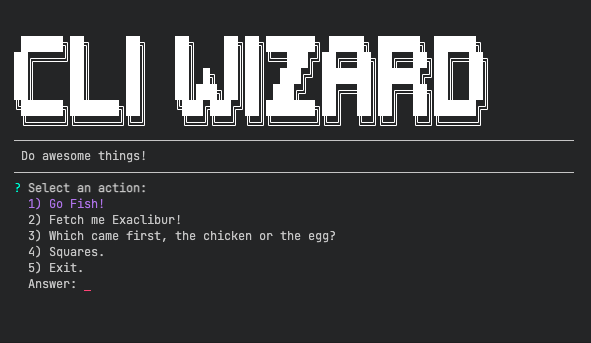

# node-cli
Create awesome command-line utilities!



## Usage

In the `package.json` file of your project, add this repo to your `dependencies` and define a `bin` command:

```javascript
// package.json
{
  "name": "my-project",
  "description": "It does stuff with things.",
  "main": "index.js",
  // ...
  "dependencies": {
    // ...
    "node-cli": "git@github.com:jiminikiz/node-cli.git"
    // ...
  },
  "bin": {
    "my-command-name": "bin/cli.js" // running `npm link` in your src directory will install this executable to your shell
  }
}
```

Then, create a bin file, something like: `~/path/to/your/src/bin/cli.js`

```javascript
#!/usr/bin/env node

const CLI = require('node-cli');

new CLI({
  verbose: true, // runs the cli-tool in verbose-mode, defaults to `false`
  font: 'Larry 3D', // the font used by the header, see `figlet` for font options, defaults to 'ANSI Shadow'
  color: '#701F82', // hex color for the cli-header, defaults to white (#FFFFFF)
  title: 'My Awesome CLI Tool', // defaults to 'node-CLI'
  caption: 'Some text to appear below the header', // defaults to empty string
  actions: { // an object whose keys are the action menu item descriptions and values are handlers
    'Go Fish!'   : () => console.log('\n', ">><((((('>", '\n'),
    'Exaclibur'  : () => console.log('\n', '@xxx[{::::::::::>', '\n'),
    'U mad bro?' : () => console.log('\n', '¯\\_(ツ)_/¯ ', '\n')
  }
}).start();

```

Link `bin/cli.js` to your shell:

```bash
npm link
```

Then you can run your command from anywhere:

```bash
my-command-name -v
```
